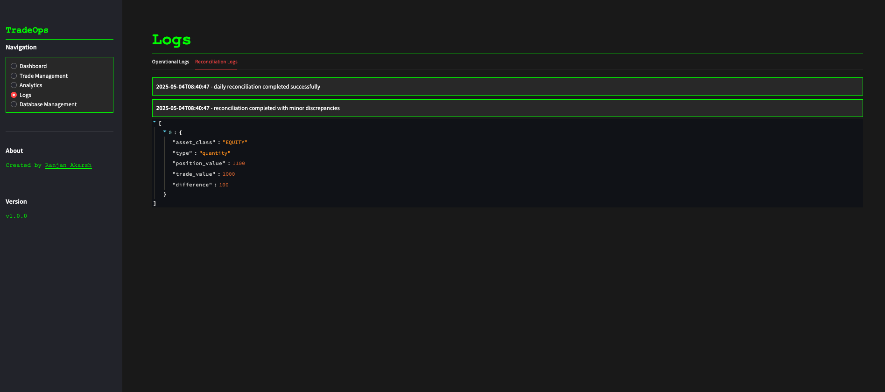

# TradeOps Portal 🚀

A comprehensive trading operations dashboard for managing trades, monitoring performance, and tracking reconciliation.

## Features

### 1. Dashboard Overview

- Real-time trading metrics
- Trading activity visualization
- Asset class distribution
- Recent trades monitoring

### 2. Trade Management

- Create new trades
- Filter and search existing trades
- View trade status and details
- Manage trade lifecycle

### 3. Analytics


- Trading volume analysis
- Performance metrics
- Asset class distribution
- Trader performance tracking

### 4. Logs and Monitoring


- Operational logs
- Reconciliation tracking
- System status monitoring
- Error tracking

### 5. Database Management

- Database statistics
- Data initialization
- Database reset capabilities
- Sample data management

## 🎯 Motivation

In the fast-paced world of quantitative trading, operational efficiency is crucial. This project emerged from a desire to explore how modern software engineering practices can enhance post-trade operations. By building a simulated environment, we can:

- Understand the complexities of trade reconciliation
- Explore data-driven approaches to operational workflows
- Implement automated solutions for repetitive tasks
- Create intuitive interfaces for complex operations
- Develop robust error handling and logging systems

The project serves as a practical exploration of how technology can improve operational efficiency in trading environments, while providing a hands-on learning experience in full-stack development.

## 🛠️ Tech Stack

- **Backend**
  - FastAPI - Modern, fast web framework
  - SQLAlchemy - SQL toolkit and ORM
  - APScheduler - Job scheduling
  - Pydantic - Data validation
  - SQLite/PostgreSQL - Database

- **Data Processing**
  - Pandas - Data manipulation
  - NumPy - Numerical computing
  - Plotly - Interactive visualizations

- **Frontend**
  - Streamlit - Interactive dashboard
  - Plotly Express - Data visualization
  - Requests - API communication

## 🚀 Getting Started

### Prerequisites

- Python 3.8+
- pip (Python package manager)
- Git

### Installation

1. Clone the repository:
```bash
git clone https://github.com/ranjanakarsh/TradeOps.git
cd TradeOps
```

2. Create and activate a virtual environment:
```bash
python -m venv .venv
source .venv/bin/activate  # On Windows: .venv\Scripts\activate
```

3. Install dependencies:
```bash
pip install -r requirements.txt
```

4. Set up the database:
```bash
# Create database
createdb tradeops

# Initialize database
python -m app.db.init_db
```

5. Start the application:
```bash
# Start FastAPI backend
uvicorn app.main:app --reload

# In a new terminal, start Streamlit frontend
streamlit run app/frontend.py
```

6. Access the application:
- Backend API: http://localhost:8000
- Frontend Dashboard: http://localhost:8501

## 📈 Future Enhancements

- **Authentication & Authorization**
  - Role-based access control
  - Secure API endpoints
  - User management

- **Data Management**
  - Bulk CSV trade upload
  - Data export functionality
  - Advanced filtering options

- **Notifications**
  - Email alerts for discrepancies
  - Real-time dashboard updates
  - Custom notification rules

- **Advanced Analytics**
  - Machine learning for anomaly detection
  - Predictive analytics
  - Custom report builder

## 📝 License

This project is licensed under the MIT License - see the [LICENSE](LICENSE) file for details.

## 🤝 Contributing

Contributions are welcome! Please feel free to submit a Pull Request.

## 📧 Contact

Ranjan Akarsh - [Instagram](https://instagram.com/ranjanakarsh)
